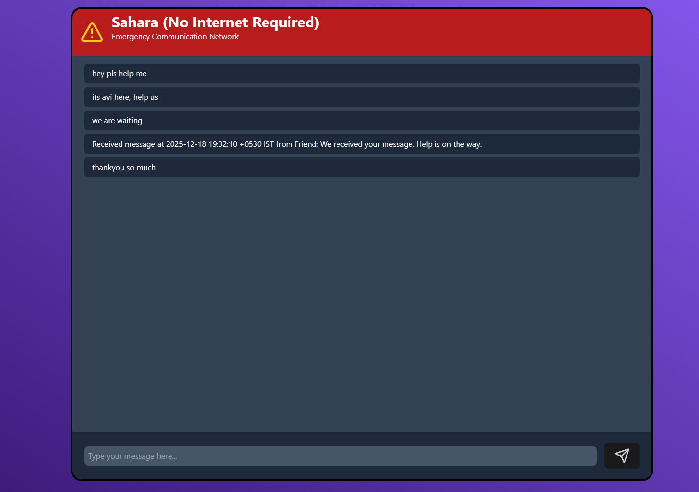

# Sahara

Sahara is an offline-first, peer-to-peer communication system for situations where internet access is unavailable. Devices communicate over the same Wi-Fi, hotspot, or local network.

## Why?

Internet and mobile networks often fail during natural disasters. Sahara provides a simple way for civilians and rescue teams on the same local network to exchange messages without relying on a remote server.

## How it works

Sahara uses [go-libp2p](https://github.com/libp2p/go-libp2p) to connect peers and GossipSub to distribute chat messages. Peers use a shared room name:

```go
roomFlag := flag.String("room", "chat-room", "name of chat room to join")
```

Pass the same room name to every peer that should join the conversation.

## Peer discovery

Sahara uses multicast DNS (mDNS) to discover other peers on the same local network. Peers must use the same `same_string` value to find one another.

## Project structure

- `cmd/Sahara/main.go` - runs the chat node, HTTP API, and terminal client.
- `cmd/Sahara/logs.txt` - stores received messages.
- `internal/p2p/host.go` - creates the libp2p host.
- `internal/p2p/mdns.go` - discovers peers with mDNS.
- `internal/p2p/pubsub.go` - implements chat rooms with GossipSub.
- `cmd/node/main.go` - connects directly to a known peer for testing.

## Frontend UI

The frontend is built with React and provides a basic interface for sending and receiving messages.



## Run locally

### Backend

From `cmd/Sahara`:

```console
go run . --port 9000 --same_string xyz --room myroom --nick Avi --enable-http=true
```

Start another peer in a second terminal:

```console
go run . --port 9001 --same_string xyz --room myroom --nick Friend
```

Both peers must use the same `same_string` and `room`. Only one peer should enable the HTTP server.

### Frontend

From `frontend`:

```console
npm install
npm run dev
```

Open the local URL printed by Vite.

Created by [Avinash](https://github.com/avinxshKD).